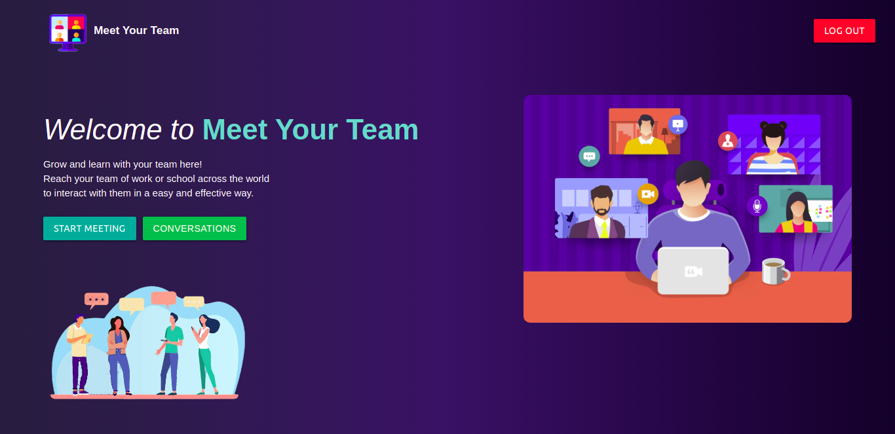
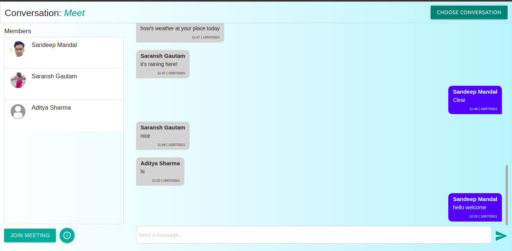
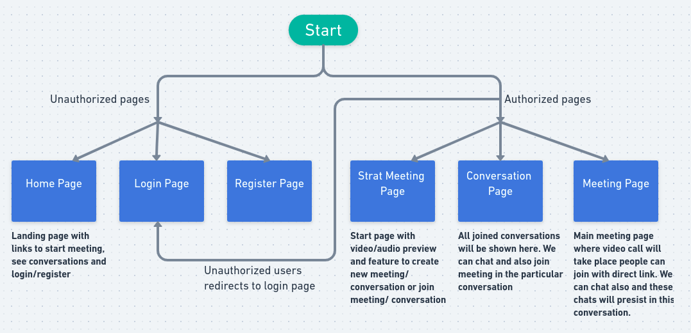

# Meet Your Team

A Microsoft Teams Clone made under Microsoft Engage 2021 program.


## Deployed web app link on Heroku

#### Click to open web app : [Meet Your Team](https://meetyourteam.herokuapp.com/)

## Design document (Agile Methodology)

#### Click to open : [Agile document](https://tinyurl.com/44yxj2z5)

## Demo video

#### Click to watch : [Demo](https://youtu.be/P4cMJiBBcwg)

## Screenshots






## Features

- Multi people video call feature
- User Authentication
- Video/Audio off/on feature
- Chat feature before meeting, during meeting and after meeting
- Fully responsive for mobile devices

## Web App flow



## Run Locally

Clone the project

```bash
  git clone https://github.com/mandalsandeep188/Meet-Your-Team
```

Go to the project directory

```bash
  cd Meet-Your-Team
```

Install dependencies

```bash
  npm install
```

Start the server

```bash
  node app
```

Open new terminal in same directory and Start the client

```bash
  cd client
  npm start
```

## Backend

- #### Server used : [Express JS](https://expressjs.com/)
- #### Database used : [MongoDB Atlas](https://www.mongodb.com/cloud/atlas)

## Frontend

- #### Frontend Library : [React JS](https://reactjs.org/)
- #### State management : [Redux](https://redux.js.org/)

## Major Libraries used

- [Peer JS for WebRTC connection](https://peerjs.com)
- [Socket IO for socket connection](https://socket.io/)
- [JWT for user authentication](https://www.npmjs.com/package/jsonwebtoken)
- [Bcrypt JS for hashing password](https://www.npmjs.com/package/bcryptjs)

### Note

There is an error coming in the browser console of the web app called “Invalid frame header” but it is not creating any issues app is working fine.
